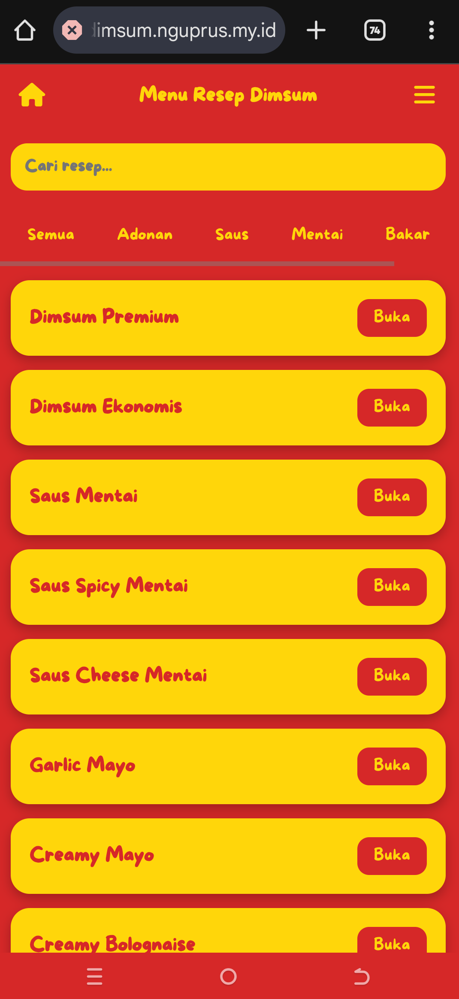
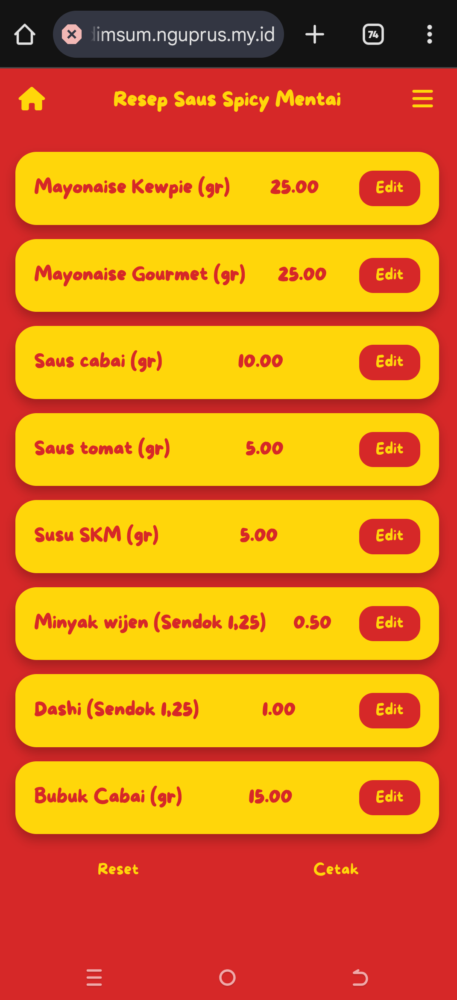

==================================================
🍳 WEB RESEP INTERAKTIF (HTML + JS)
==================================================

Demo Live:
https://resep.nguprus.my.id

==================================================
BADGE GITHUB
==================================================

Gunakan badge berikut di README.md (jika pakai markdown):

[]
[]
[]
[]

==================================================
SCREENSHOT
==================================================

Tambahkan file screenshot di folder:
/assets/

Contoh:
/assets/home.png
/assets/resep.png

Lalu tampilkan di README.md seperti:

Jika hanya TXT, cukup cantumkan gambar di repo saja.

==================================================
DESKRIPSI
==================================================

Website resep masakan berbasis:
- HTML
- CSS
- JavaScript (Vanilla)

Tanpa framework, ringan, cepat, dan bisa langsung di‑hosting statis.

Dirancang seperti aplikasi mobile fullscreen dengan tema merah–kuning.

==================================================
FITUR UTAMA
==================================================

✓ Tampilan fullscreen mobile (seperti aplikasi Android/iOS)
✓ Sidebar menu (☰)
✓ Tombol Home
✓ Edit bahan proporsional otomatis
✓ Reset resep
✓ Cetak resep
✓ Pencarian resep
✓ Pagination
✓ Tema merah–kuning konsisten
✓ Font custom More Sugar
✓ Tanpa database
✓ Siap GitHub Pages / hosting statis

==================================================
STRUKTUR FOLDER
==================================================

/
│
├── index.html                  → halaman utama (menu resep)
├── resep-*.html                → halaman tiap resep
│
├── /data
│   ├── menu-data.js            → data sidebar menu
│   └── resep-data.js           → daftar resep halaman depan
│
├── /fonts
│   └── MoreSugar.ttf
│
├── /assets                     → screenshot (opsional)
│
└── README.txt

==================================================
PENJELASAN FILE
==================================================

index.html
Halaman utama berisi:
- daftar semua resep
- search
- kategori
- pagination
- sidebar

Semua resep dibaca dari:
/data/resep-data.js

/data/menu-data.js
Mengatur isi sidebar menu (☰)

Contoh:

const menuItems = [
  { label:"Tentang", icon:"fa-circle-info", link:"#"},
  { label:"WhatsApp", icon:"fa-brands fa-whatsapp", link:"https://wa.me/628xxxx" }
];

Tambah menu cukup edit file ini saja.

/data/resep-data.js
Mengatur daftar resep di halaman depan.

Format:

"Nama Resep": "file.html | kategori1,kategori2"

Contoh:

"Creamy Mushroom": "resep-creamy-mushroom.html | creamy,saus"

==================================================
CARA MENAMBAH RESEP BARU
==================================================

1. Copy salah satu file resep sebagai template
2. Ganti nama file, contoh:
   resep-sambal.html
3. Tambahkan di:
   /data/resep-data.js

"Sambal Pedas": "resep-sambal.html | sambal,pedas"

Selesai. Resep otomatis muncul.

==================================================
CARA EDIT SIDEBAR
==================================================

Edit:
/data/menu-data.js

Tidak perlu ubah halaman HTML lainnya.

==================================================
TEKNOLOGI
==================================================

HTML5
CSS3
JavaScript (Vanilla)
Font Awesome

Semua file berbasis HTML & JS saja.
Tidak ada backend.

==================================================
CARA MENJALANKAN
==================================================

Langsung buka:
index.html

atau upload ke:
- GitHub Pages
- Netlify
- Vercel
- Hosting statis lain

==================================================
WARNA TEMA
==================================================

Merah  : #d62828
Kuning : #ffd60a

==================================================
SELESAI
==================================================
